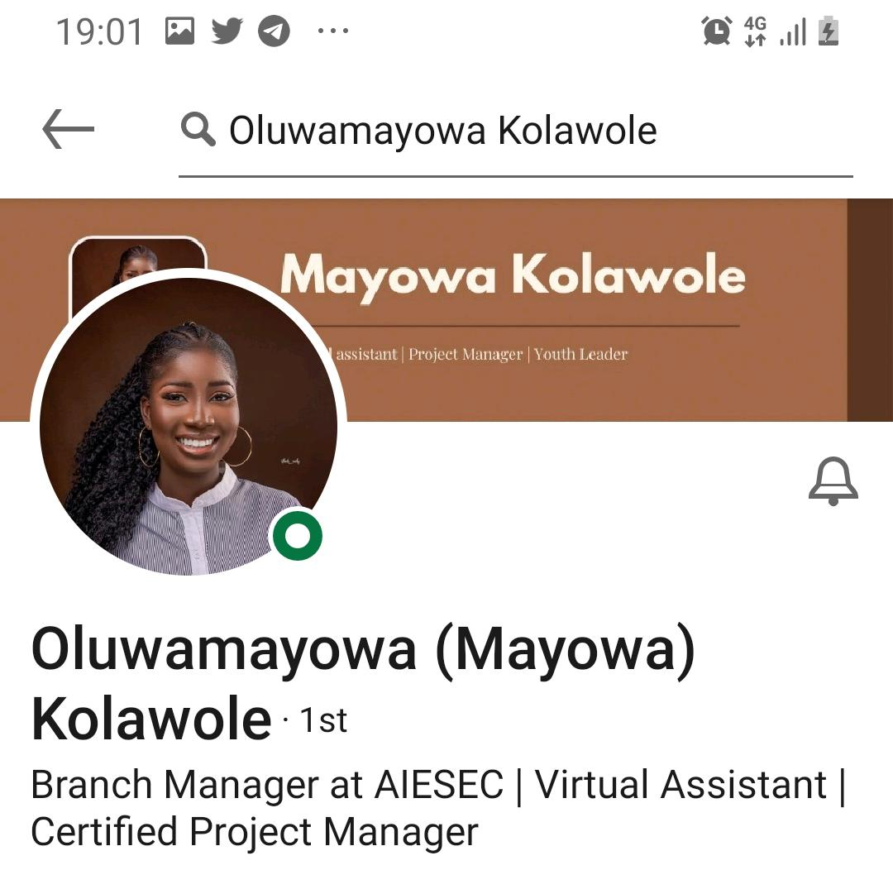
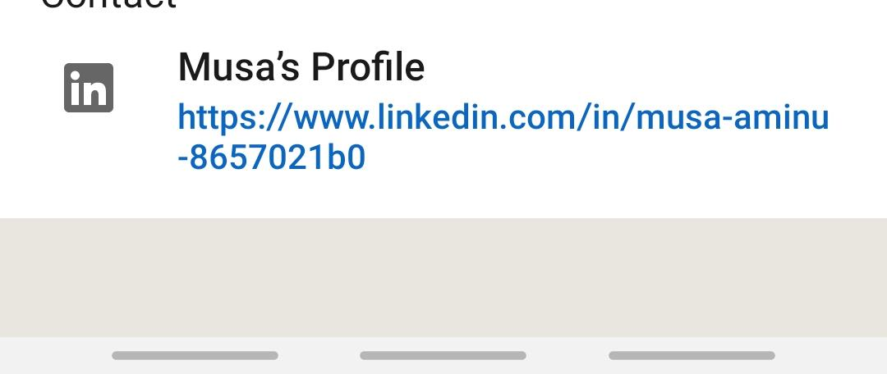
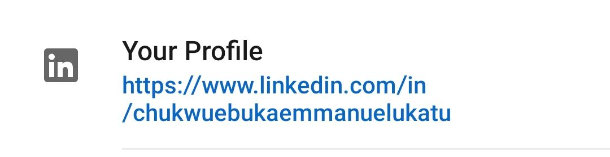

# LinkedIn Lesson given on codeinn

Good evening everyone.


We all know about LinkedIn, but the truth is most of us don't know how to use it to our advantage.

LinkedIn isn't about setting up a profile to show you do something, it's also a great tool for networking with the right persons and landing high end jobs, depending on your niche.

Optimization helps recruiting agencies and potential client to find your profile; this is an advantage you could have against other folks.

## Step 1
Take a clean upperbody shot of yourself; if you can take a photo in the studio, the better. However whatever picture you use the uppermost part of your body needs to be clean.
> Your full face has to show--all edges.

## Step 2
This step is crucial, having a particular niche you focus on is an unknown advantage. For instance, if you are a fullstack developer, you can use something like this:  
`Full stack developer: HTML, CSS, JavaScript, and Django`.  
Or     
`Full stack developer with professional efficiency in HTML, CSS, JavaScript, and Django`.

Highlighting on the specific skillset is another way of ranking when recruiters use the search option to find talents within the specific skillset requirement they need.

## Example
For step 1 and 2 here is an example.

<br>
  
  
Take Notice of

- her profile picture
- her uppermost body shot
- And also notice how she used the step 2 graciously here.

## Step 3

The About section in LinkedIn is also a good area you could apply SEO.


Using specific keywords in your niche is great, because it helps you rank higher than the average folk.

Here is a template you could use:

```txt
[Introduction and what you do]

[Your list of competencies]

[How your competency/What your skillset helps your employer gain]

[CTA]
```

When writing out your about, make sure to use keywords that are mostly used within your niche.

E.g If you are a UI/UX designer, talking about the way your designs affects user experience etc

## Step 4

Your LinkedIn profile link (most people don't know)

To do this, use your laptop to login, on your profile dashboard look for it, it's something like this in the first picture

<br>

It shouldn't be this way, this shows unprofessionalism and unseriousness... It should be this 👇

<br>


## Step 5

Connecting with random people is what most folks do.

C'mon man, if you are a fullstack developer what business do you have connecting with an affiliate marketer.🌚🌚


> Be like you no wan make

So here is a nice way to connect with potential employers in your `niche`

Use these `keywords`

```txt
Founder + niche
Founder + niche
Founder + niche
Founder + niche

Co-Founder + niche
Co-Founder + niche
Co-Founder + niche
Co-Founder + niche

CMO + niche

HR + Niche

CTO + niche
```

When you use this keywords and you connect with this sort of folks, some of them will view your profile..🌚🌚

Or it could go straight to interviews after they must have viewed your profile 

When these folks view your profile, you can go ahead and do a soft pitching

When someone views your profile, the person definitely found it curious to check it out...these folks are busy they have jobs and businesses to run but they checked your profile

You could use a message like this👇


```txt 
Hi Kelvin, 

Thanks for accepting my invitation to connect – I was hoping to write you a 
brief message with my invitation to connect, but unfortunately it whizzed 
away before I had a chance!
I noticed that you viewed my profile. I wondered if you may be looking for a 
freelance writer and perhaps we should connect?
Look forward to keeping in touch,
Lindy
```

Most of them will reply you, because they viewed your profile and accepted your request the connection is already there
